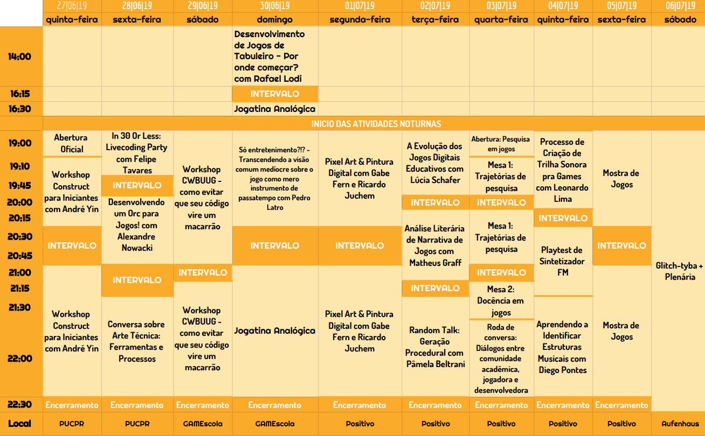

# Glitch-tyba
Essa é a página da célula de Curitiba do [Glitch Mundo](https://glitchmundo.github.io/main/). Para ver anuncios gerais ou a programação completa de atividades, [cola aqui](https://glitchmundo.github.io/main/)!

### Um jeito diferente de pensar sobre coisas

O Glitch Mundo é um espaço seguro e aberto de jogos e experiências interativas. É tão aberto que não só todo mundo pode ir, mas todo mundo pode fazer! Saiba mais sobre como organizar seu Glitch Mundo [aqui](https://github.com/GlitchMundo/main/wiki/). É tão seguro que cada existência do Glitch Mundo deve seguir nosso [código de conduta](https://github.com/GlitchMundo/main/wiki/c%C3%B3digo-de-conduta), nosso [manifesto](https://github.com/GlitchMundo/main/wiki/manifesto) e nossas [diretrizes](https://github.com/GlitchMundo/main/wiki/diretrizes).

**Juntos somos mais fortes. Juntos, nós somos independentes.**

# Agora

O Glitch-tyba Mundo 2019.01 vai acontecer entre os dias 20/06 e 06/06 em três lugares: [Hot&#x2011;Milk](https://goo.gl/maps/X9yA3coWWSpGA8Wg8), [GAMEscola](https://goo.gl/maps/fGSc3sM7e4MgSamLA), [Universidade Positivo Unidade Praça Santos Andrade](https://goo.gl/maps/vvwv7NsuvL7Qk25A6). O evento é aberto à todos e terá entrada franca.

<strong>
<a href="https://forms.gle/MZTMQpMf7E6h3KKFA" style="margin: 2em 1em; padding: 1em; border: 1px solid #ca6; display: block; border-radius: 0.5em; background: #fc5; text-align: center; text-transform: uppercase; color: white; box-shadow: 0 0 1em rgba(128, 128, 128, 0.2)">As inscrições podem ser feitas aqui!</a>
</strong>

## Visão Geral do Evento

<table style="overflow-x: scroll;display: block;">
  <thead>
    <tr>
      <th>Data</th>
      <th style="text-align: center">27/06 (Quinta)</th>
      <th style="text-align: center">28/06 (Sexta)</th>
      <th style="text-align: center">29/06 (Sábado)</th>
      <th style="text-align: center">30/07 (Domingo)</th>
      <th style="text-align: center">01/07 (Segunda)</th>
      <th style="text-align: center">02/07 (Terça)</th>
      <th style="text-align: center">03/07 (Quarta)</th>
      <th style="text-align: center">04/07 (Quinta)</th>
      <th style="text-align: center">05/07 (Sexta)</th>
      <th style="text-align: left">06/07 (Sábado)</th>
    </tr>
  </thead>
  <tbody>
    <tr>
      <td>Tema</td>
      <td style="text-align: center"><a href="a">Abertura &amp; Construct para Iniciantes</a></td>
      <td style="text-align: center"><a href="b">Arte 3D &amp; VFX</a></td>
      <td style="text-align: center"><a href="c">Unity Meetup</a></td>
      <td style="text-align: center"><a href="j">Jogos Analógicos</a></td>
      <td style="text-align: center"><a href="d">Pixel Art &amp; Pintura Digital</a></td>
      <td style="text-align: center"><a href="e">Game Design</a></td>
      <td style="text-align: center"><a href="f">Academia e Jogos</a></td>
      <td style="text-align: center"><a href="g">Música &amp; Som</a></td>
      <td style="text-align: center"><a href="h">Mostra de Jogos</a></td>
      <td style="text-align: left"><a href="i">Glitch-tyba</a></td>
    </tr>
    <tr>
      <td>Local</td>
      <td style="text-align: center"><a href="https://goo.gl/maps/53gJRS9YBjfzdM6p8">Hot‑Milk</a></td>
      <td style="text-align: center"><a href="https://goo.gl/maps/53gJRS9YBjfzdM6p8">Hot‑Milk</a></td>
      <td style="text-align: center"><a href="https://goo.gl/maps/dxxDHdnDxJXYFRsF6">GAMEscola</a></td>
      <td style="text-align: center"><a href="https://goo.gl/maps/dxxDHdnDxJXYFRsF6">GAMEscola</a></td>
      <td style="text-align: center"><a href="https://goo.gl/maps/RGhL3Kq2robpdtCd7">UP</a></td>
      <td style="text-align: center"><a href="https://goo.gl/maps/RGhL3Kq2robpdtCd7">UP</a></td>
      <td style="text-align: center"><a href="https://goo.gl/maps/RGhL3Kq2robpdtCd7">UP</a></td>
      <td style="text-align: center"><a href="https://goo.gl/maps/RGhL3Kq2robpdtCd7">UP</a></td>
      <td style="text-align: center"><a href="https://goo.gl/maps/RGhL3Kq2robpdtCd7">UP</a></td>
      <td style="text-align: left"><a href="https://goo.gl/maps/QjNw3QpWz8kqgBsL9">Aufenhaus</a></td>
    </tr>
    <tr>
      <td>&nbsp;</td>
      <td style="text-align: center">&nbsp;</td>
      <td style="text-align: center">&nbsp;</td>
      <td style="text-align: center">&nbsp;</td>
      <td style="text-align: center">&nbsp;</td>
      <td style="text-align: center">&nbsp;</td>
      <td style="text-align: center">&nbsp;</td>
      <td style="text-align: center">&nbsp;</td>
      <td style="text-align: center">&nbsp;</td>
      <td style="text-align: center">&nbsp;</td>
      <td style="text-align: left">&nbsp;</td>
    </tr>
  </tbody>
</table>

[construct]: a
[3d]: b
[unity]: c
[pixel]: d
[gd]: e
[academia]: f
[som]: g
[mostra]: h
[glitchtyba]: i
[analogicos]: j

## <a name="construct">Dia 27/06: Abertura + Construct para Iniciantes</a>
**Local: [Hot&#x2011;Milk](https://goo.gl/maps/X9yA3coWWSpGA8Wg8)**

| Evento                      | Convidados | Horário |
|-----------------------------|------------|---------|
| Construct para Iniciantes   | André Yin  | 19:00 h |
| Intervalo                   |            | 20:30 h |
| Construct para Iniciantes   | André Yin  | 21:00 h |
| Encerramento                |            | 22:30 h |

## <a name="3d">Dia 28/06: Arte 3D & VFX</a>
**Local: [Hot&#x2011;Milk](https://goo.gl/maps/X9yA3coWWSpGA8Wg8)**

| Evento                                               | Convidados        | Horário |
|------------------------------------------------------|-------------------|---------|
| In 30 Or Less: Livecoding Party                      | Felipe Tavares    | 19:00 h |
| Intervalo                                            |                   | 19:45 h |
| Desenvolvendo um Orc para Jogos!                     | Alexandre Nowacki | 20:00 h |
| Intervalo                                            |                   | 21:00 h |
| Conversa sobre Arte Técnica: Ferramentas e Processos |                   | 21:30 h |
| Encerramento                                         |                   | 22:15 h |

## <a name="unity">Dia 29/06: Unity Meetup</a>
**Local: [GAMEscola](https://goo.gl/maps/fGSc3sM7e4MgSamLA)**

| Evento                                                                         | Convidados   | Horário |
|--------------------------------------------------------------------------------|--------------|---------|
| Workshop CWBUUG - Utilizando Design Patterns em Unity: Singleton & Observer   | Gustavo Dort | 19:00 h |
| Intervalo                                                                      |              | 21:00 h |
| Workshop CWBUUG - Utilizando Design Patterns em Unity: Singleton & Observer   | Gustavo Dort | 21:15 h |

## <a name="analogicos">Dia 30/06: Jogos Análogicos</a>
**Local: [GAMEscola](https://goo.gl/maps/fGSc3sM7e4MgSamLA)**

| Evento                                                                                                         | Convidados   | Horário |
|----------------------------------------------------------------------------------------------------------------|--------------|---------|
| Desenvolvimento de Jogos de Tabuleiro - Por onde começar?                                                      | Rafael Lodi  | 14:00 h |
| Intervalo                                                                                                      |              | 16:15 h |
| Jogatina Analógica                                                                                             |              | 16:30 h |
| Só entretenimento?!? - Transcendendo a visão comum medíocre sobre o jogo como mero instrumento de passatempo   | Pedro Latro  | 19:00 h |
| Jogatina Analógica                                                                                             |              | 21:00 h |

## <a name="pixel">Dia 01/07: Pixel Art & Pintura Digital</a>
**Local: [Universidade Positivo Unidade Praça Santos Andrade](https://goo.gl/maps/vvwv7NsuvL7Qk25A6)**

| Evento                      | Convidados                 | Horário |
|-----------------------------|----------------------------|---------|
| Pixel Art & Pintura Digital | Gabe Fern & Ricardo Juchem | 19:00 h |
| Intervalo                   |                            | 20:30 h |
| Pixel Art & Pintura Digital | Gabe Fern & Ricardo Juchem | 21:00 h |
| Encerramento                |                            | 22:30 h |

## <a name="gd">Dia 02/07: Game-Design</a>
**Local: [Universidade Positivo Unidade Praça Santos Andrade](https://goo.gl/maps/vvwv7NsuvL7Qk25A6)**

| Evento                                   | Convidados                            | Horário |
|------------------------------------------|---------------------------------------|---------|
| A evolução dos jogos digitais educativos | Lúcia Wolf Schafer                    | 19:00 h |
| Intervalo                                |                                       | 20:00 h |
| Análise literária de narrativa de jogos  | Matheus Graff                         | 20:15 h |
| Intervalo                                |                                       | 21:15 h |
| Random Talk: Geração Procedural          | Pâmela Beltrani ou Eduardo Martinelli | 21:30 h |
| Encerramento                             |                                       | 22:30 h |

## <a name="academia">Dia 03/07: Academia e Jogos</a>
**Local: [Universidade Positivo Unidade Praça Santos Andrade](https://goo.gl/maps/vvwv7NsuvL7Qk25A6)**

| Evento                                                                           | Convidados | Horário |
|----------------------------------------------------------------------------------|------------|---------|
| Abertura: Pesquisa em jogos                                                      |            | 19:00 h |
| Mesa 1: Trajetórias de pesquisa                                                  |            | 19:10 h |
| Intervalo                                                                        |            | 20:15 h |
| Mesa 2: Docência em jogos                                                        |            | 20:45 h |
| Roda de conversa: Diálogos entre comunidade acadêmica, jogadora e desenvolvedora |            | 21:30 h |
| Encerramento                                                                     |            | 22:30 h |

## <a name="som">Dia 04/07: Música e Som</a>
**Local: [Universidade Positivo Unidade Praça Santos Andrade](https://goo.gl/maps/vvwv7NsuvL7Qk25A6)**

| Evento                                  | Convidados     | Horário |
|-----------------------------------------|----------------|---------|
| Aguardando Tema                         | Leonardo Lima  | 19:00 h |
| Intervalo                               |                | 20:00 h |
| Playtest de Sintetizador FM             | Felipe Tavares | 21:15 h |
| Aguardando Tema                         | Diego Pontes   | 21:30 h |
| Encerramento                            |                | 22:30 h |

## <a name="mostra">Dia 05/07: Mostra de Jogos</a>
**Local: [Universidade Positivo Unidade Praça Santos Andrade](https://goo.gl/maps/vvwv7NsuvL7Qk25A6)**

| Evento          | Horário |
|-----------------|---------|
| Mostra de Jogos | 19:00 h |
| Intervalo       | 21:15 h |
| Mostra de Jogos | 22:00 h |
| Encerramento    | 22:30 h |

## <a name="glitchtyba">Dia 06/07: Encerramento + Plenária</a>
**Local: [Empório Aufenhaus](https://goo.gl/maps/EHCuo4Jporp4RtYe8)**

# Histórico
### [2018.01](https://github.com/GlitchMundo/main/wiki/glitch-mundo-2018)
